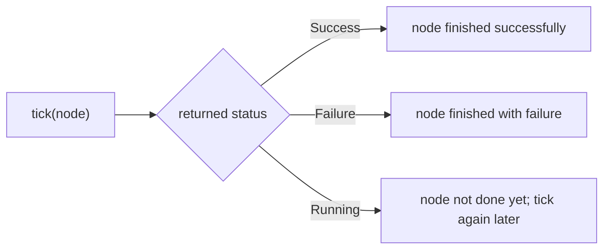
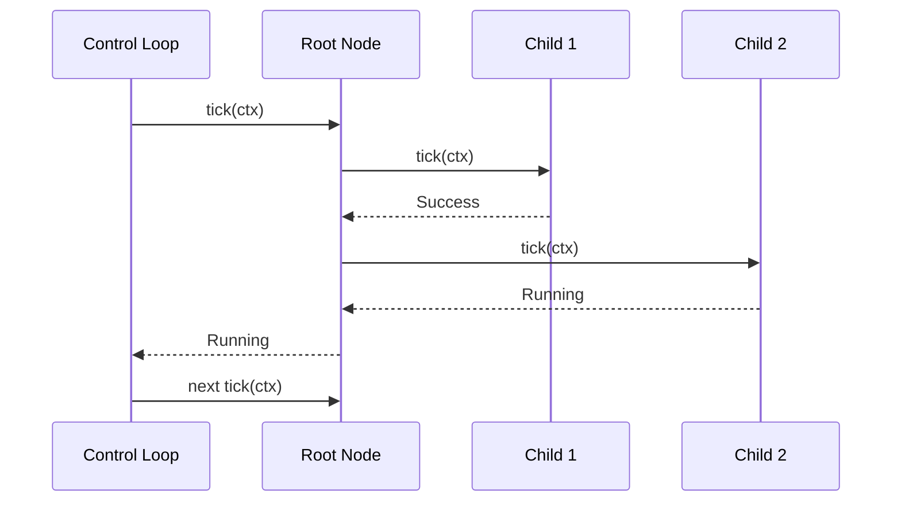
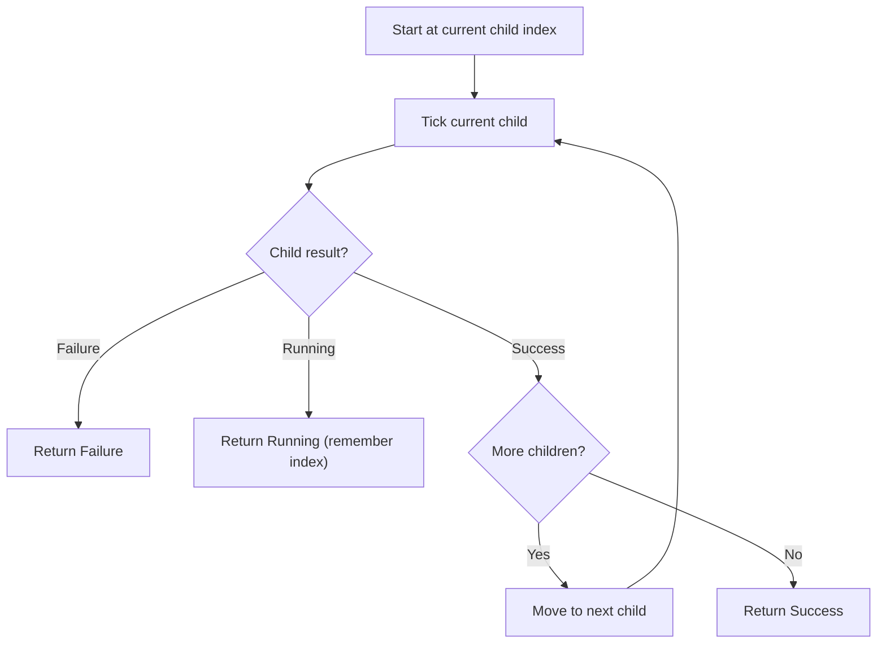
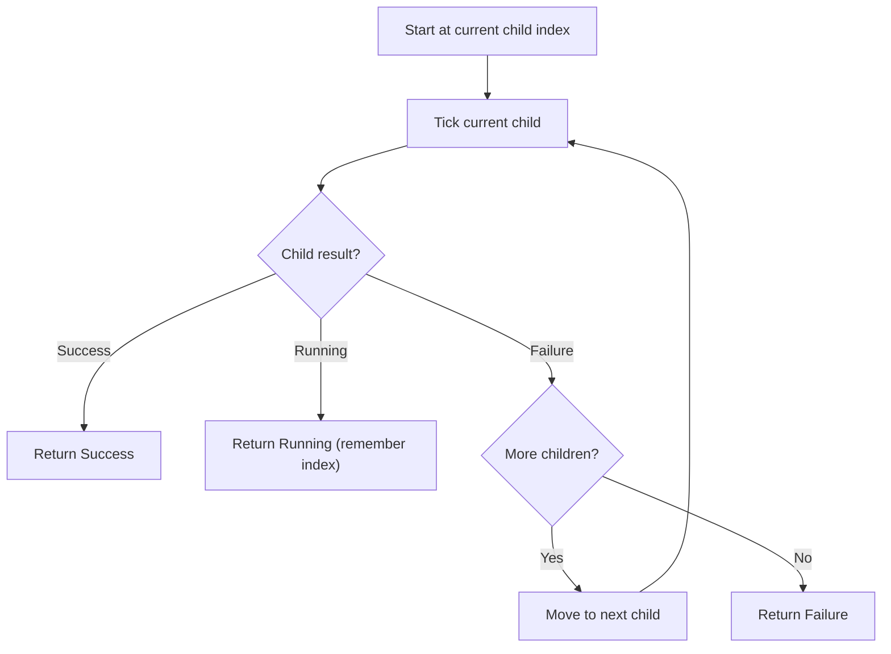
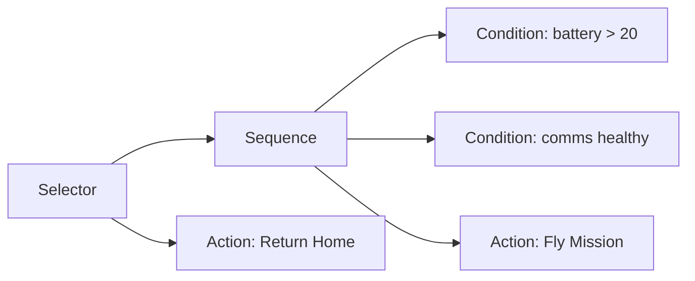
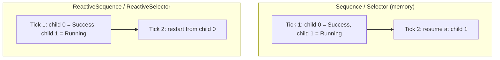

# Arbor

Arbor is a Rust behavior tree workspace for deterministic, async-native control logic.

## Workspace

- `arbor-core`: `no_std` behavior tree primitives and semantics.
- `arbor`: Tokio-facing crate that re-exports core + `TokioClock` + `tick_until_done`.

## Beginner Guide

### 1) What is a behavior tree?

A behavior tree is a decision tree that is **ticked** repeatedly.

Each node returns one of three statuses:

- `Success`: this node finished and succeeded.
- `Failure`: this node finished and failed.
- `Running`: this node is still in progress.



### 2) How ticking works

Every loop iteration, you tick the root node.
Parents tick children; children return statuses; parent decides what to tick next.



### 3) Core node types in Arbor

#### Leaf nodes

- `Action`: async work, returns `Running/Success/Failure`.
- `Condition`: checks a predicate, returns `Success/Failure`.
- `Constant`: always returns a fixed status.

#### Composite nodes

- `Sequence`: run children left-to-right; fail fast; succeed only if all succeed.
- `Selector`: run children left-to-right; succeed fast; fail only if all fail.
- `ReactiveSequence`: like `Sequence`, but restarts from child 0 every tick.
- `ReactiveSelector`: like `Selector`, but restarts from child 0 every tick.
- `Parallel`: ticks all children every tick with a policy:
  - `SuccessOnAllFailureOnAny`
  - `SuccessOnAnyFailureOnAll`
  - `SuccessThreshold(usize)`

`Sequence` flow:



`Selector` flow:



#### Decorator nodes

- `Inverter`
- `Retry`
- `Repeat`
- `Timeout`
- `ForceSuccess`
- `ForceFailure`

### 4) A simple fallback tree (real Arbor API)

Goal: if normal mission checks pass, execute mission; otherwise run fallback action.



```rust
use std::time::Duration;
use arbor::{Action, Condition, Selector, Sequence, Status, tick_until_done};

#[derive(Debug)]
struct DroneCtx {
    battery_pct: f32,
    comms_healthy: bool,
    mission_flew: bool,
    rtl: bool,
}

# #[tokio::main(flavor = "current_thread")]
# async fn main() {
let mut tree = Selector::new((
    Sequence::new((
        Condition::new(|ctx: &DroneCtx| ctx.battery_pct > 20.0),
        Condition::new(|ctx: &DroneCtx| ctx.comms_healthy),
        Action::new(|ctx: &mut DroneCtx| async move {
            ctx.mission_flew = true;
            Status::Success
        }),
    )),
    Action::new(|ctx: &mut DroneCtx| async move {
        ctx.rtl = true;
        Status::Success
    }),
));

let mut ctx = DroneCtx {
    battery_pct: 80.0,
    comms_healthy: true,
    mission_flew: false,
    rtl: false,
};

let status = tick_until_done(&mut tree, &mut ctx, Duration::from_millis(20)).await;
assert_eq!(status, Status::Success);
# }
```

### 5) Memory vs reactive nodes (important)

- `Sequence` and `Selector` are **memory nodes**.
  - If child 2 is `Running`, next tick resumes at child 2.
- `ReactiveSequence` and `ReactiveSelector` are **reactive nodes**.
  - Every tick starts again from child 0.

Use reactive nodes when earlier conditions must be re-checked continuously.



### 6) Building trees in Arbor

Arbor trees are composed with Rust types and tuple children:

- `Sequence::new((child_a, child_b, child_c))`
- `Selector::new((option_a, option_b))`
- `Parallel::with_policy((a, b, c), ParallelPolicy::SuccessThreshold(2))`

This keeps node wiring typed and allocation-free in the hot tick path.

## Running and testing

Run the example:

```bash
cargo run -p arbor --example drone_mission
```

Run the full test suite:

```bash
cargo fmt --all
cargo test --workspace
```

## What is tested

`arbor-core/tests` covers:

- node semantics for all leaf/composite/decorator types
- short-circuit and memory/resume tick counts
- reactive re-check behavior
- timeout behavior with a mock clock
- property-based checks for key invariants
