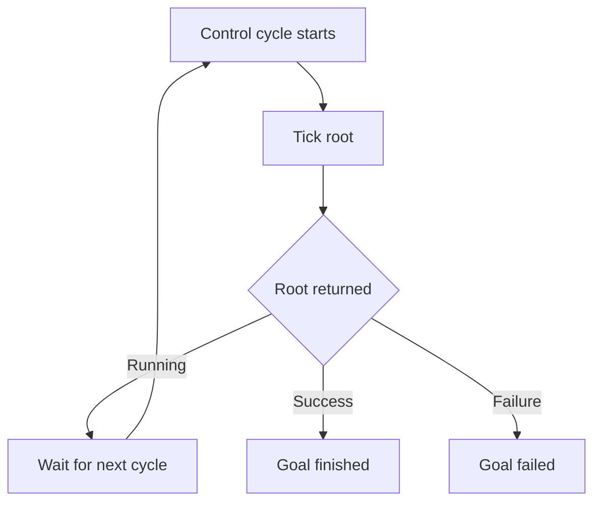
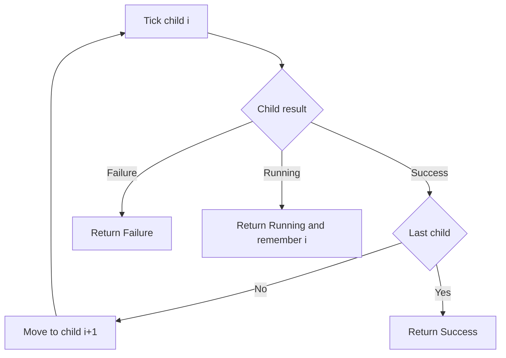
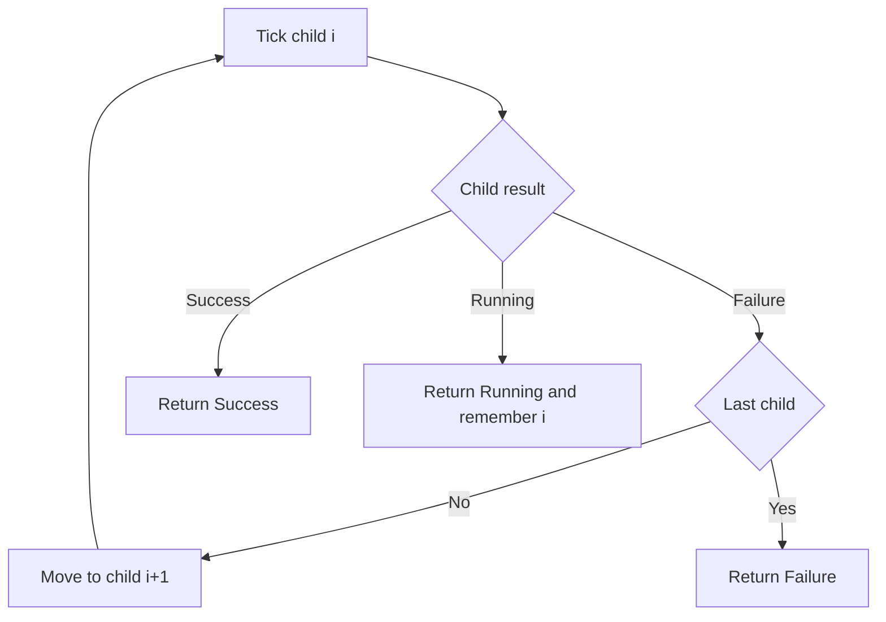
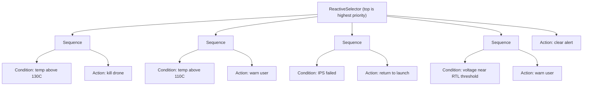

# Arbor

Arbor is a Rust behavior tree runtime for deterministic control logic.
It is async-native, strongly typed, and designed for predictable tick behavior.

## Workspace

- `arbor-core`: `no_std` tree primitives and semantics.
- `arbor`: Tokio-facing crate (`TokioClock`, `tick_until_done`, re-exports).

## Behavior trees in plain language

A behavior tree is a decision pipeline you run every control cycle.

- You tick the root node.
- The root ticks children based on node rules.
- Each node returns a `Status`.

`Status` has three values:

- `Success`: completed and succeeded.
- `Failure`: completed and failed.
- `Running`: still in progress, tick again next cycle.



## Quick start

```rust
use std::time::Duration;
use arbor::{Action, Condition, Selector, Sequence, Status, tick_until_done};

#[derive(Default)]
struct DroneCtx {
    battery_pct: f32,
    comms_ok: bool,
    mission_flew: bool,
    rtl: bool,
}

# #[tokio::main(flavor = "current_thread")]
# async fn main() {
let mut tree = Selector::new((
    Sequence::new((
        Condition::new(|ctx: &DroneCtx| ctx.battery_pct > 20.0),
        Condition::new(|ctx: &DroneCtx| ctx.comms_ok),
        Action::new(|ctx: &mut DroneCtx| async move {
            ctx.mission_flew = true;
            Status::Success
        }),
    )),
    Action::new(|ctx: &mut DroneCtx| async move {
        ctx.rtl = true;
        Status::Success
    }),
));

let mut ctx = DroneCtx {
    battery_pct: 55.0,
    comms_ok: true,
    ..Default::default()
};

let result = tick_until_done(&mut tree, &mut ctx, Duration::from_millis(20)).await;
assert_eq!(result, Status::Success);
assert!(ctx.mission_flew);
# }
```

## Node types and when to use them

### Leaf nodes

`Condition` checks state and returns `Success` or `Failure`.

```rust
# use arbor::Condition;
# struct Ctx { battery_temp_c: f32 }
let hot = Condition::new(|ctx: &Ctx| ctx.battery_temp_c > 110.0);
```

`Action` performs work and can be async.

```rust
# use arbor::{Action, Status};
# struct Ctx { warned: bool }
let warn_user = Action::new(|ctx: &mut Ctx| async move {
    ctx.warned = true;
    Status::Success
});
```

`Constant` always returns the same status.

```rust
# use arbor::{Constant, Status};
let always_fail = Constant::new(Status::Failure);
```

### Composite nodes

`Sequence`: "do steps in order."

- Fails on first failure.
- Returns running on first running child.
- Succeeds only when all children succeed.
- Remembers the running child and resumes there next tick.



```rust
# use arbor::{Action, Condition, Sequence, Status};
# struct Ctx { armed: bool, airborne: bool }
let takeoff = Sequence::new((
    Condition::new(|c: &Ctx| c.armed),
    Action::new(|c: &mut Ctx| async move {
        c.airborne = true;
        Status::Success
    }),
));
```

`Selector`: "try options in priority order."

- Succeeds on first success.
- Returns running on first running child.
- Fails only if all children fail.
- Remembers the running child and resumes there next tick.



```rust
# use arbor::{Action, Selector, Status};
# struct Ctx { primary_ok: bool, fallback_used: bool }
let pick_plan = Selector::new((
    Action::new(|c: &mut Ctx| async move {
        if c.primary_ok { Status::Success } else { Status::Failure }
    }),
    Action::new(|c: &mut Ctx| async move {
        c.fallback_used = true;
        Status::Success
    }),
));
```

`ReactiveSequence` and `ReactiveSelector` are re-checking variants.

- They always restart from child 0 on every tick.
- Use them when early conditions must be continuously revalidated.

```rust
# use arbor::{Action, Condition, ReactiveSelector, Sequence, Status};
# struct Ctx { comms_ok: bool, rtl: bool }
let safety = ReactiveSelector::new((
    Sequence::new((
        Condition::new(|c: &Ctx| !c.comms_ok),
        Action::new(|c: &mut Ctx| async move {
            c.rtl = true;
            Status::Success
        }),
    )),
    Action::new(|_c: &mut Ctx| async move { Status::Success }),
));
```

`Parallel` ticks all children every tick and decides with a policy.

```rust
# use arbor::{Parallel, ParallelPolicy};
let all_must_pass = Parallel::new((
    arbor::Constant::new(arbor::Status::Success),
    arbor::Constant::new(arbor::Status::Running),
    arbor::Constant::new(arbor::Status::Failure),
));
let any_may_pass = Parallel::with_policy(
    (
        arbor::Constant::new(arbor::Status::Success),
        arbor::Constant::new(arbor::Status::Running),
        arbor::Constant::new(arbor::Status::Failure),
    ),
    ParallelPolicy::SuccessOnAnyFailureOnAll,
);
let two_of_three = Parallel::with_policy(
    (
        arbor::Constant::new(arbor::Status::Success),
        arbor::Constant::new(arbor::Status::Running),
        arbor::Constant::new(arbor::Status::Failure),
    ),
    ParallelPolicy::SuccessThreshold(2),
);
```

### Decorator nodes

Decorators wrap one child and modify its result.

```rust
# use core::time::Duration;
# use arbor::{
#     Action, Condition, ForceFailure, ForceSuccess, Inverter, Repeat, Retry, Status, Timeout,
#     TokioClock,
# };
# struct Ctx;
let inverter = Inverter::new(Condition::new(|_c: &Ctx| false)); // Failure -> Success
let retry = Retry::new(Action::new(|_c: &mut Ctx| async move { Status::Failure }), 3);
let repeat = Repeat::new(Action::new(|_c: &mut Ctx| async move { Status::Success }), 5);
let timeout = Timeout::new(
    Action::new(|_c: &mut Ctx| async move { Status::Running }),
    TokioClock,
    Duration::from_millis(200),
);
let force_success = ForceSuccess::new(Action::new(|_c: &mut Ctx| async move { Status::Failure }));
let force_failure = ForceFailure::new(Action::new(|_c: &mut Ctx| async move { Status::Success }));
```

## Example scenario: drone safety rules

Policy:

1. If battery temperature is above 130C, kill the drone.
2. Else if battery temperature is above 110C, warn the user.
3. Else if the ice protection system fails, return to launch.
4. Else if voltage is near RTL threshold, warn the user.
5. Else, no alert this cycle.



Why the condition and action are siblings under `Sequence`:

- In a sequence, child 2 runs only if child 1 succeeded.
- So `Condition + Action` in one sequence means "if condition is true, then do action."

```rust
use arbor::{Action, Condition, Node, ReactiveSelector, Sequence, Status};

#[derive(Debug, Default)]
struct DroneCtx {
    battery_temp_c: f32,
    ips_ok: bool,
    pack_voltage_v: f32,
    rtl_voltage_v: f32,
    command: Command,
    alert: Option<&'static str>,
}

#[derive(Debug, Default, Clone, Copy, PartialEq, Eq)]
enum Command {
    #[default]
    None,
    Warn,
    ReturnToLaunch,
    Kill,
}

# #[tokio::main(flavor = "current_thread")]
# async fn main() {
let mut tree = ReactiveSelector::new((
    Sequence::new((
        Condition::new(|c: &DroneCtx| c.battery_temp_c > 130.0),
        Action::new(|c: &mut DroneCtx| async move {
            c.command = Command::Kill;
            c.alert = Some("Battery temperature critical");
            Status::Success
        }),
    )),
    Sequence::new((
        Condition::new(|c: &DroneCtx| c.battery_temp_c > 110.0),
        Action::new(|c: &mut DroneCtx| async move {
            c.command = Command::Warn;
            c.alert = Some("Battery temperature high");
            Status::Success
        }),
    )),
    Sequence::new((
        Condition::new(|c: &DroneCtx| !c.ips_ok),
        Action::new(|c: &mut DroneCtx| async move {
            c.command = Command::ReturnToLaunch;
            c.alert = Some("IPS failed");
            Status::Success
        }),
    )),
    Sequence::new((
        Condition::new(|c: &DroneCtx| c.pack_voltage_v <= c.rtl_voltage_v + 0.20),
        Action::new(|c: &mut DroneCtx| async move {
            c.command = Command::Warn;
            c.alert = Some("Voltage near RTL threshold");
            Status::Success
        }),
    )),
    Action::new(|c: &mut DroneCtx| async move {
        c.command = Command::None;
        c.alert = None;
        Status::Success
    }),
));

let mut ctx = DroneCtx {
    battery_temp_c: 112.0,
    ips_ok: true,
    pack_voltage_v: 15.1,
    rtl_voltage_v: 14.9,
    ..Default::default()
};

let _ = tree.tick(&mut ctx).await; // one control cycle
assert_eq!(ctx.command, Command::Warn);
# }
```

## Running and testing

Run the included example:

```bash
cargo run -p arbor --example drone_mission
```

Run all tests:

```bash
cargo fmt --all
cargo test --workspace
```
